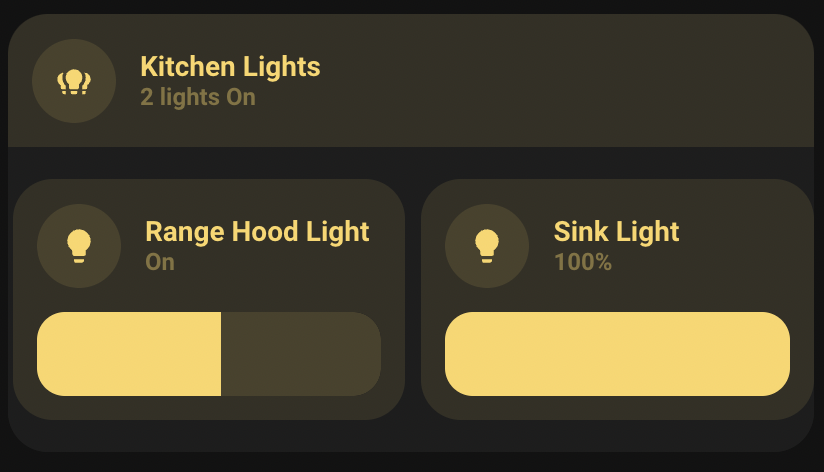
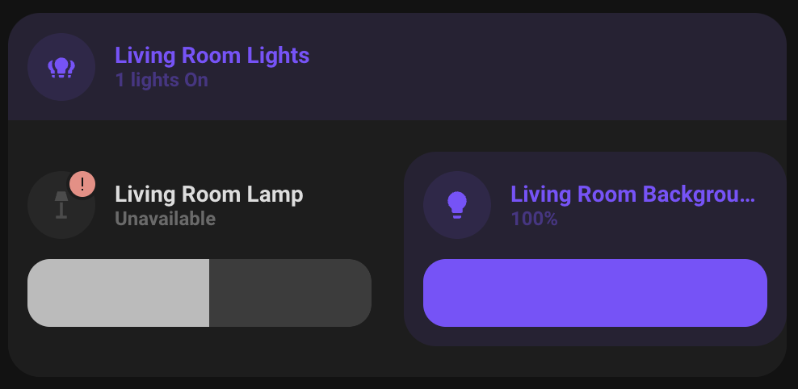

# Custom-card "Light Group"
This is a custom-card to give a count of how many lights in a group are on as well as provide controls for each individual light in the group.

## Credits
Author: PartemImperium - 2022  
Version: 1.0.0  

## Changelog

1.0.0

Initial release

## Requirements
This card needs the following to function correctly:

<table>
<tr>
<th>Component / card</th>
<th>required</th>
<th>Note</th>
</tr>
<tr>
<td><a href="https://github.com/thomasloven/lovelace-auto-entities">auto-entities</a></td>
<td>x</td>
<td>Used to create the individual light controls for each light in the group.</td>
</table>

## Usage

<pre><code class="language-yaml" style="border: 0">
- type: custom:button-card
  template:
    - "card_light_group_count"
  entity: light.dining_room_lights
</code></pre>

## Variables
Variables are passed into the individual light controls (and the group light control). As such any variable for the [native minimalist light control](https://ui-lovelace-minimalist.github.io/UI/usage/cards/card_light/#variables) can be passed to affect the controls. However the "ulm_card_light_enable_slider" variable is overriden to always be false on the group control.
<!-- 
<table>
<tr>
<th>Variable</th>
<th>Example</th>
<th>Required</th>
<th>Explanation</th>
</tr>
<tr>
<td></td>
<td></td>
<td></td>
<td></td>
</tr>
</table> -->
